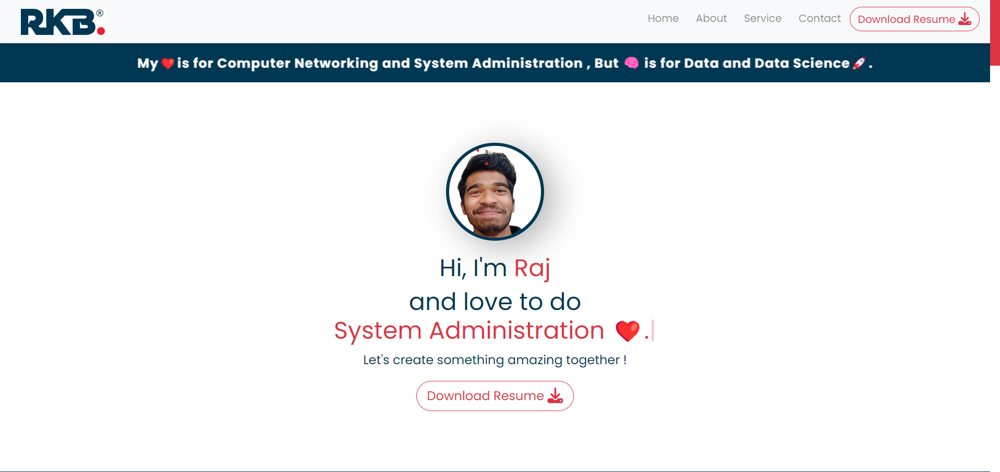

<h1 align=center> PortFolio_Website_With_PHP_Backend </h1>
<h3 align="center"> <a href="https://rajinfotechportfolio.000webhostapp.com/" target="_blank"> Visit My Portfolio Website 🔗↗️</a></h3>

<h3 align="center">Follow This Steps To Run This Website Locally 😊.</h3>

<ol>
<h4>
<li>Firstly Download The Pre-requisites Like A Code Editor And XAMPP Server Software And Install Them.</li>
 
<li>Pull This Website Form My Git-Hub To Your Local Device .</li>
 
<li>Then Extract The Folder And Move This Folder In " C:\xampp\htdocs\Portfolio ". Here " \Portfolio " Folder Is A User Defined Folder . </li>
 
<li>Then Start The XAMPP Server. Then After Click Start Buttons Of " Apache " and " MySQL " .After They Become Green Click Admin Button Of " MySQL ".After That It Will Open A " PHP My Admin " Tab In Your Default Browser. </li>
 
<li>Then In The " PHP My Admin " Click Import Then Choose My MySQL Database File From My Above Database Folder Then Click Import. </li>
 
<li>Then Go TO Any Browser Then Type " localhost/Your Folder Name " . In My Case " Portfolio " Is My Folder Name . </li>
 
<li>Now You Can See My Full-fledged Portfolio Website With Front-end And Back-end .</li>
</h4>
</ol>

<h2 align="center">Thank You 🙏😊❤️.</h2>
